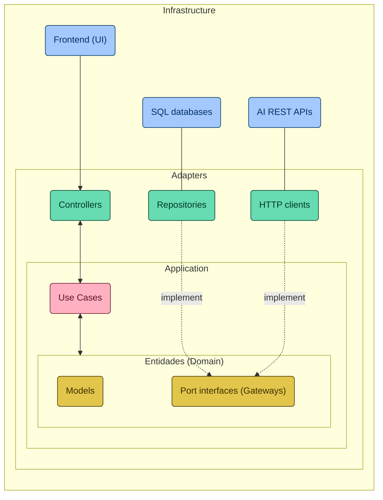

# Creation of a REST API project with AI

## 📚 About the Project

In this repository, you will find the source code of a REST API, built with Java 21 and Spring Boot 3, (developed during the Santander Dev Week 2024)

> [!NOTE]
> Objective: "Allow users to converse with League of Legends (LOL) champions".

To achieve this, i used some of the latest Generative Artificial Intelligences (AIs), enabling our API to "understand" the unique personality of each champion to create interactions that capture their essence, making each conversation a unique experience.

## 🏛️ Project Architecture

### Architectural Diagram
Next, I'll show you the project's architectural diagram (written with [Mermaid](https://mermaid.js.org/)), highlighting the separation of responsibilities between the layers. From the user interface to the mechanisms for interacting with external systems, including adapters, use cases and the central entities of the domain, each element is strategically positioned to reinforce the modularity, scalability and maintainability of the system. This structure makes it easier to understand how the components collaborate to achieve the software's objectives, in line with the principles of [Clean Architecture](https://blog.cleancoder.com/uncle-bob/2012/08/13/the-clean-architecture.html) (including the colors of the elements).



### Directory Structure

Reflecting the organization shown in the architectural diagram, the project's directory structure suggests a simplified Clean Architecture, aiming for a clear separation of responsibilities and promoting the autonomy of the layers in a Spring Boot project. This structural approach not only facilitates code maintenance and evolution, but also supports integration and effective collaboration between the different parts of the application. Below, we detail the layout of the directories that make up the application, each playing a specific role within the software ecosystem:

-   `adapters/`: It includes the adapters that facilitate communication between the application and the outside world (the only directory that “knows” Spring).
    -   `in/`: It houses the input adapters, such as REST controllers, which handle user requests.
    -   `out/`: It contains the outbound adapters, responsible for interacting with databases and external APIs, for example.
-   `application/`: It hosts the application's use cases, encapsulating the essential business logic.
-   `domain/`: It represents the heart of the application, comprising entities, exceptions and interfaces (ports) that articulate the fundamental business rules.
    -   `exception/`: Defines the custom exceptions relevant to the domain.
    -   `model/`: It models the entities of the domain, reflecting the core concepts of the application.
    -   `ports/`: It establishes the interfaces that outline the contracts for adapters and external services.
-   `Application.java`: The main class that orchestrates the configuration and execution of the application.

### SQL Database in Memory

The use of the H2 database in this project serves as an agile and flexible foundation for modeling our knowledge domain - the LOL champions. This choice allows for rapid prototyping and an efficient development environment, which is essential for storing and retrieving detailed information about each champion. In this way, we ensure that the Generative AIs we integrate can access a rich and detailed repository, allowing them to accurately capture the essence and unique personality of each champion, thus enriching the interactivity and depth of the interactions carried out.

```sql
CREATE TABLE IF NOT EXISTS champions (
    id INT AUTO_INCREMENT PRIMARY KEY,
    name VARCHAR(255) NOT NULL,
    role VARCHAR(255) NOT NULL,
    lore TEXT,
    image_url VARCHAR(255)
);

INSERT INTO champions (name, role, lore, image_url) VALUES
   ('Jinx', 'Marksman', 'An impulsive and manic criminal from Zaun, Jinx lives to spread chaos without caring about the consequences. With an arsenal of deadly weapons, she sets off the loudest and brightest explosions to leave a trail of destruction and panic wherever she goes. Jinx abhors boredom and happily leaves her chaotic mark of mayhem wherever she travels.', 'https://ddragon.leagueoflegends.com/cdn/img/champion/splash/Jinx_0.jpg'),
('Vi', 'Fighter', 'A former street criminal from the violent streets of Zaun, Vi is a fearsome, impulsive, and explosive woman with very little respect for authority. Having grown up entirely on her own, Vi has developed extremely accurate survival instincts and an extremely acidic sense of humor. Now working with the Piltover Enforcers to maintain peace, she wields powerful hextech gauntlets capable of smashing walls and suspects with equal ease.', 'https://ddragon.leagueoflegends.com/cdn/img/champion/splash/Vi_0.jpg'),
('Ekko', 'Assassin', 'A prodigy from the violent streets of Zaun, Ekko manipulates time to reverse any situation in his favor. Using his own invention, the Z-Drive, he explores the possible branches of reality to create the perfect moment. Although he values his freedom greatly, when something threatens his friends, he spares no effort to defend them. To mere observers, Ekko seems to achieve the impossible effortlessly.', 'https://ddragon.leagueoflegends.com/cdn/img/champion/splash/Ekko_0.jpg'),
('Caitlyn', 'Marksman', 'Known as Piltover\'s finest peacekeeper, Caitlyn is also the city\'s best choice for ridding it of its elusive criminal elements. She often partners with Vi, acting as a calm counterpart to her partner\'s impulsive nature. Even though she carries a unique hextech rifle, Caitlyn\'s most powerful weapon is her superior intellect, which allows her to set elaborate traps for any foolish outlaw daring enough to operate in the City of Progress.', 'https://ddragon.leagueoflegends.com/cdn/img/champion/splash/Caitlyn_0.jpg'),
('Jayce', 'Fighter', 'Jayce is a brilliant inventor who has dedicated his life to defending Piltover and its relentless pursuit of progress. With his transformative hextech hammer in hand, Jayce uses his strength, courage, and considerable intelligence to protect his hometown. Although hailed by the city as a hero, he doesn\'t particularly enjoy the attention that heroism brings. Nevertheless, Jayce\'s heart is in the right place, and even those who envy his natural abilities are grateful for how he safeguards the City of Progress.', 'https://ddragon.leagueoflegends.com/cdn/img/champion/splash/Jayce_0.jpg'),
('Viktor', 'Mage', 'Viktor, the herald of a new era of technology, has devoted his life to advancing humanity. An idealist who seeks to elevate the people of Zaun to a new level of understanding, he believes that only by embracing the glorious evolution of technology can humanity reach its true potential. With a body enhanced by steel and science, Viktor is zealous in his pursuit of this bright future.', 'https://ddragon.leagueoflegends.com/cdn/img/champion/splash/Viktor_0.jpg'),
('Heimerdinger', 'Mage', 'A brilliant, if eccentric, scientist, Professor Cecil B. Heimerdinger is one of Piltover\'s most innovative and esteemed inventors. Tireless in his work to the point of neurotic obsession, he seeks to answer the most impenetrable questions of the universe. Although his theories often seem obscure and esoteric, Heimerdinger has produced some of Piltover\'s most miraculous, not to mention lethal, machines, constantly fine-tuning his inventions to make them even more efficient.', 'https://ddragon.leagueoflegends.com/cdn/img/champion/splash/Heimerdinger_0.jpg'),
('Singed', 'Tank', 'Singed is a zaunite alchemist of unparalleled intellect who has devoted his life to pushing the boundaries of knowledge; and no price, not even his own sanity, is too high. Is there a cure for his madness? His concoctions rarely fail, but to many, Singed has lost any semblance of humanity, leaving a toxic trail of misery and terror in his wake.', 'https://ddragon.leagueoflegends.com/cdn/img/champion/splash/Singed_0.jpg'),
('Ryze', 'Mage', 'Considered by most to be the most skilled mage in Runeterra, Ryze is an ancient and bitter archmage burdened with immense power. Endowed with vast arcane power and a notable physical structure, he tirelessly seeks the World Runes, which are fragments of pure magic that once created the world from nothing. He must retrieve these artifacts before they fall into the wrong hands, as Ryze knows well the horrors they can inflict on Runeterra.', 'https://ddragon.leagueoflegends.com/cdn/img/champion/splash/Ryze_0.jpg'),
('Master Yi', 'Assassin', 'Master Yi has trained his body and sharpened his mind so that thought and action become almost one. Although he prefers to resort to violence as a last resort, the swiftness and speed of his sword ensure a swift resolution. As one of the last practitioners of the Ionian art of Wuju, Yi has dedicated his life to preserving his people\'s legacy, evaluating potential disciples with the Seven Lenses of Insight to identify which one is most worthy.', 'https://ddragon.leagueoflegends.com/cdn/img/champion/splash/MasterYi_0.jpg'),
('Garen', 'Fighter', 'A noble and proud warrior, Garen is part of the Dauntless Vanguard. Popular among his comrades and respected enough by his enemies, his reputation is nothing less than expected of a scion of the prestigious Crownguard family, tasked with defending Demacia and its ideals. Clad in magic-resistant armor and wielding a powerful sword, Garen is always ready to confront mages and sorcerers on the battlefield, a true whirlwind of virtuous steel.', 'https://ddragon.leagueoflegends.com/cdn/img/champion/splash/Garen_0.jpg'),
('Teemo', 'Marksman', 'Indifferent to the most dangerous and threatening obstacles, Teemo traverses the world with infinite enthusiasm and excitement. A yordle with unwavering morals who prides himself on following the Scouts Code of Bandle City, sometimes with such dedication that he fails to grasp the potential consequences of his actions. Although some doubt the existence of the scouts, one thing is certain: one should never doubt Teemo convictions.', 'https://ddragon.leagueoflegends.com/cdn/img/champion/splash/Teemo_0.jpg');
```
